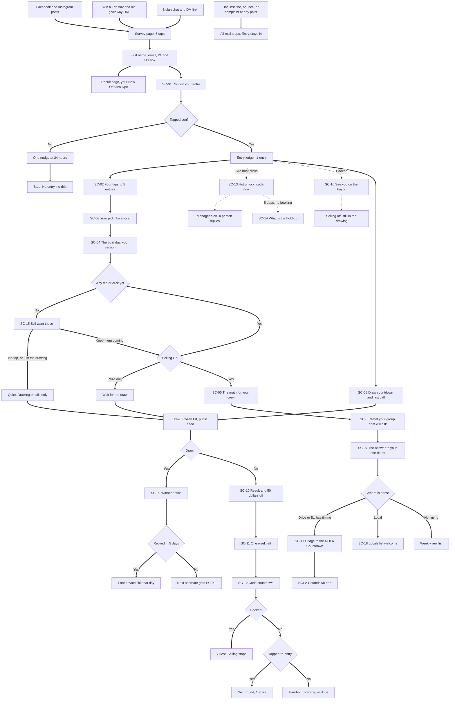

# Survey Contest Funnel: Blueprint

*Drafted 2026-10-03 for David. Internal. Draft only: nothing here is sent, posted, or deployed. This is a new front door into the Sept 30 lead plan and fh-lead-engine, not a second system. Facts are as of 2026-10-03. Anything marked [VERIFY] is not confirmed and can't go in copy until it is.*

## The 5 line version

1. **The funnel:** a post asks "What do you love most about New Orleans?" Five taps and an email later they get their New Orleans type, tap one confirm link, and they're in a monthly drawing for a free private tiki boat.
2. **The dates:** entries open quietly Thu Oct 22, 2026. Launch post Sat Oct 24. First draw Mon Nov 16. Second draw Mon Dec 14. Go or no-go is Mon Oct 19.
3. **The drip:** 18 emails built from 18 swap blocks. Same email, different words, picked at send time from what they tapped: what they love, who they'd bring, where home is, how many, when, and the one doubt they named.
4. **The money:** everyone who doesn't win gets an offer of $50 off a private boat for 14 days, with the per-person math for their group. Hot leads and people riding inside 30 days get it early. A booked guest leaves the selling and stays in the drawing.
5. **How it was built:** the Operator proposal is the base, the blocks come from Segmentation, the offer comes from Offer. One thing all three got wrong: bonus entries for referring friends. Meta's rules ban that now, so it's cut. You have 14 decisions in section 13. The first three block the launch.

## 1. Scores

| Proposal | Fit to the ask | Branching a reader notices | Conversion | Runs by Oct 20, small build | Compliance | Total |
|:-|:-|:-|:-|:-|:-|:-|
| **Operator** (base) | 7 | 6 | 6 | 9 | 8 | **36** |
| Offer | 8 | 7 | 9 | 5 | 6 | 35 |
| Segmentation | 9 | 10 | 7 | 4 | 5 | 35 |

| Proposal | Why it scored that way |
|:-|:-|
| Operator | Found 5 real bugs in the engine. I checked all 5 against the code today and they're there. Confirm-to-enter, one schedule list per lead, blocks picked at send time, a draw anyone can re-run. Weak on the ask: 14 emails, content ends on day 9, first winner not until Dec 2. |
| Offer | Best money mechanics: the code held back as a second payoff, per-person math, the hot unlock, a booked winner rides twice, a result page that pays off the survey. Too big for Oct 20 (21 emails), and it leans hardest on referral entries (+3 for each of 10 friends). |
| Segmentation | Best answer to "super complex based on what they pick": the echo line, product guards, name the doubt then answer it. But click-flipping, tracked interests, and a referral ledger all land in the MVP, there's no confirm step, and nothing protects the sending domain. |

All three lose a compliance point for the same thing: paying entries for referred friends. That was the facts file default too. Section 2 has the fix.

## 2. Conflicts, and the call on each

| Conflict | Call | Why |
|:-|:-|:-|
| Bonus entries for referring friends (all three proposals) | **Cut** | Meta's Pages policy, read live on 2026-10-03, says a promotion "must not require or incentivize participants to share, repost, tag others". A personal link that pays entries is an incentive. The rules draft (doc 03 in this folder) found the same thing. |
| Entry cap: 10, 16, or about 40 | **5** | 1 for confirming, +1 for each of the first 4 bonus answers. A mailed-in card counts as 5. |
| 4 questions or 5 before the email | **5 taps** | All 5 change what gets sent. On-page taps are the only answers link scanners can't fake. Only question 1 is required. If finish rate is under 25%, question 5 moves to the result page. |
| Confirm step | **Yes, confirm-to-enter** | New sending domain on a shared SES account. A fake address gets one email, ever. |
| First draw: Nov 2, Nov 13, Nov 16, or Dec 2 | **Mon Nov 16** | Nov 2 is 9 days, before the warm-up finishes. Dec 2 is six weeks with no winner and no offer. Mid-month leaves the code 14 days to live. |
| Open date | **Thu Oct 22, quiet. Post Sat Oct 24** | Oct 20 is the engine's first live day and a past-guest send day. |
| When the $50 shows up | **After the draw** | Early only for hot leads and people riding inside 30 days. |
| Time to claim: 72 hours or 5 days | **5 days, reminder at 48 hours** | Email is the only notice, and it can land in spam. Matches the rules draft. |
| Re-entry | **One tap, not automatic** | Each month is its own drawing. No tap, no more contest mail. |
| Email count: 14, 16, or 21 | **18 templates** | Keeps Offer's hold-up email. Segmentation's click-flip waits until after the first draw. |
| Content length: day 9 or day 15 | **Day 15** | Keeps Segmentation's best pair: ask the doubt, then answer it. |
| Result page with a "type" | **Yes** | It's the payoff for answering, win or not. |
| How the draw runs | **Frozen list plus a public seed, two people present** | A loser can check it. |
| Winner publicity | **Standard release in the rules. Filming the ride is an ask** | A happy winner says yes anyway. |
| Group size buckets | **2-6, 7-12, 13-18, 19+** | They match the boats (pontoon 6, Bayou Boogie 18, tikis 25, Party Queen 26). |
| Code name | **`BAYOU50-NOV`, not a name with "win" in it** | Louisiana limits "you have won" wording aimed at people who didn't win. |

## 3. The survey

One question per screen, big buttons, tap only. Question 1 is required. Questions 2 to 5 each have a small "skip" link. Nothing is stored until the email is submitted, so there are no half-leads.

| # | Question | Options (exact) | Field and tags |
|:-|:-|:-|:-|
| 1 | What do you love most about New Orleans? | The food / The music / Going out / The bayou and the gators / Parades and festivals / The people | `like` = food, music, night, wild, parade, people |
| 2 | Where's home? | New Orleans area / A drive away / I'd fly in | `home` = local, drive, fly |
| 3 | If you win the boat, who's coming? | Bachelorette crew / Bachelor crew / Birthday crew / Friends, no reason needed / Family and the cousins / Work crew / A date or a few of us | `group_type` = bach, bachelor, birthday, just_because, family, work, couples |
| 4 | How many would you bring? | 2 to 6 / 7 to 12 / 13 to 18 / 19 or more | `group_size` = 2-6, 7-12, 13-18, 19+ |
| 5 | When could you see yourself out here? | In the next 30 days / The holidays / Mardi Gras season / Spring or summer 2027 / No plans, I'm here for the free boat | `ride_when` = soon, holiday, mardigras, later, none |

Question 5's options carry dates, so they live in config and change each round.

**Then the form:** first name, email, and one required, unchecked box: "I'm 21 or older, I live in the United States, and I agree to the Official Rules." Under the email field: "We'll email you about the drawing, plus New Orleans trip tips and offers from NOLA Party Barge. Unsubscribe with one click anytime. It won't change your entry." No phone field. Consent wording, time, and IP get saved. Both lines match the rules draft.

**Result page: "Your New Orleans type."** The type name also shows up in the emails as `{type}`.

| `like` | Type | Boat angle (facts file only) |
|:-|:-|:-|
| food | The Po'boy Scholar | Sunset Cocktail Cruise and Seafood Boil, from $165, about 2.5 hours, first drink included |
| music | The Frenchmen Regular | Bluetooth sound system and party lights, your playlist |
| night | The Go-Cup Champion | BYOB, with a bar to set up your drinks |
| wild | The Gator Spotter | Gators, herons, cypress, the storm surge barrier. Swamp Eco Tour from $50 |
| parade | The Parade Chaser | A boat day between parades. Covered, heated in winter |
| people | The Porch Sitter | $59 seats on a social cruise (21+), or your own boat |

Under the type: "Tap the email we just sent to lock in your entry", and the first two bonus questions as buttons. No share button, no referral link.

**Notes for the post, page, and rules writers**

| For | Note |
|:-|:-|
| Posts | The post question is the exact wording of question 1. Six options now (the organic brief has five, so add "The people"). Round 1 closes Sun Nov 15, 11:59pm CT, so the brief's Nov 1 last call becomes a mid-run reminder, and the story ladder starts Thu Oct 22. No post offers extra entries for anything but the survey. |
| Rules page | Set `{MAX_BONUS}` to 4, `{MAX_TOTAL}` to 5, `{RESPONSE_DAYS}` to 5. Section 4a needs one line: the entry counts once they tap the confirm button in our email. Section 5 should say bonus entries come from the follow-up questions on the result page and in our emails. Dates come from section 4 below. |

## 4. Contest mechanics

The full rules text is the rules draft (doc 03 in this folder). This table is the short version. Where the two disagree, the rules draft gets fixed to match, unless the lawyer says otherwise.

| Item | Rule |
|:-|:-|
| Type | Sweepstakes, random draw. No purchase necessary. Booking or buying never adds entries. Each month is its own drawing with its own rules page. Entries don't roll over. |
| Who | 21+, US residents. One person, one email (the dedupe key strips `+tags` and Gmail dots). Crew and their families can't win. |
| How to enter | Finish the survey, then tap the confirm button in the first email. No confirm tap, no entry. |
| Bonus entries | +1 for each of your first 4 bonus answers (the follow-up questions on the result page and in the emails). **Max 5 per person per round.** |
| Free mail-in entry | A postcard to 2101 Paris Road counts as 5 entries, no survey needed. Cards must arrive by the close date. [VERIFY: lawyer. The rules draft gives cards 5 business days after the close. If the lawyer wants that, the close moves up a week to Sun Nov 8 and the draw stays Nov 16.] |
| Never an entry | Referring, tagging, sharing, reposting, commenting, following, reviewing, booking. Comments are welcome. They just aren't entries. |
| Prize | One private 1 hr 45 min charter on a tiki boat for the winner and up to 24 guests, captain and crew included. About $1,200 retail value. BYOB, so the prize includes no alcohol. The winner pays nothing: no deposit, no fees. Eligible days, blackout dates, and a ride-by date apply. [VERIFY: decision 2] |
| Winner | Emailed from info@nolapartybarges.com and nowhere else, as the "potential winner". 5 days to reply, one reminder at 48 hours, then the next alternate. A manager checks ID (21+) and sends a short form to sign through DocuSeal. A written prize confirmation goes out within 10 days. |
| The $50 offer | Every confirmed non-winner gets $50 off a private boat, hard expiry at least 14 days out. Book by the date, ride any date. $350 holds the boat, the rest is due the day you ride. |
| Wording rule | The $50 is an offer, never a prize. Non-winner copy never says "you won", "congratulations", "everyone wins", or "consolation prize". Louisiana law limits that wording. |
| Booked guests | Stay in the drawing. If one wins, they get a second boat day inside the prize window. |
| Unsubscribed entrants | Stay in the drawing. A winner who unsubscribed gets the winner notice and nothing else. [VERIFY: lawyer] |
| Re-entry | Not automatic. One button in the result email puts them in the next round at 1 entry. |
| Scam guard | The footer of every email and every contest post says: "We only contact the winner by email from info@nolapartybarges.com. We'll never ask for a card number." |

**Calendar (all times CT)**

| | November drawing | December drawing |
|:-|:-|:-|
| Entries open | **Thu Oct 22, 2026**, quiet (nav item, bio link, stories). Launch post Sat Oct 24, 4:00pm | Mon Nov 16, 12:00pm |
| Draw countdown email (SC-08a) | Thu Nov 12, 10am | Thu Dec 10, 10am |
| Last call email (SC-08b) | Sun Nov 15, 10am | Sun Dec 13, 10am |
| Entries close | Sun Nov 15, 11:59pm | Sun Dec 13, 11:59pm |
| List frozen, hash posted | Mon Nov 16, 9:00am | Mon Dec 14, 9:00am |
| **Draw** | **Mon Nov 16, 12:00pm** | **Mon Dec 14, 12:00pm** |
| Winner email (SC-09) | Mon Nov 16 by 1pm, after the manager check | Mon Dec 14 by 1pm |
| Result email (SC-10) | Mon Nov 16, 2pm, in batches. Leftovers Wed Nov 18, 10am | Mon Dec 14, 2pm. Leftovers Wed Dec 16, 10am |
| Reply deadline for the winner | Sat Nov 21, 1pm. Then the first alternate gets 5 days | Sat Dec 19, 1pm |
| One week left (SC-11) | Mon Nov 23, 10am | Mon Dec 21, 10am |
| Code countdown (SC-12a, SC-12b) | Sun Nov 29, 10am and Mon Nov 30, 9am | Wed Dec 30, 10am and Thu Dec 31, 9am |
| Code, dies at 11:59pm | `BAYOU50-NOV`, Mon Nov 30 | `BAYOU50-DEC`, Thu Dec 31 |
| Prize ride-by date | Sun May 16, 2027 | Mon Jun 14, 2027 |

- **No scheduled contest email lands on a Tuesday.** Past-guest sends in this window are Oct 27 and Nov 17. Only SC-01 (instant) and SC-09 (winner) can go out on a Tuesday.
- Quiet dates on top of Tuesdays: Thu Nov 26, Dec 24, Dec 25.
- If Oct 19 is a no-go, open Thu Oct 29 or Thu Nov 5. The close stays Nov 15. No copy hardcodes the open date.
- `BAYOU50` is a contest-only twin of `CREW50`: same $50, same private boats, same expiry (decision 8). Copy always uses `{code}` and `{code_end}`.

**The draw, built so a loser can check it**

1. `draw.py snapshot` writes one row per entry (hashed key) to a file, adds any mailed-in cards at 5 rows each, and takes the file's SHA-256.
2. A manager posts that hash in the managers' Slack channel at 9:00am. The timestamp proves the list was frozen first.
3. At noon, with two people present, the seed is a public random number that didn't exist at 9:00am [VERIFY: NIST Randomness Beacon still publishes, else drand]. Winner = hash(list hash + seed) mod total entries. Three alternates the same way.
4. A manager checks the winner (not crew or family) before SC-09 sends. The file and the log are kept 2 years in `~/Projects/fh-lead-engine/draws/`, never in the vault.

## 5. Segment model

| Dimension | Field | Values | Set by | Changes copy? | What it swaps |
|:-|:-|:-|:-|:-|:-|
| What they love | `like` | 6 | Q1 | Yes, the most | LIKE-ECHO, LIKE-PICKS, LIKE-BOAT, one subject line |
| Who they'd bring | `group_type` | 7 values, 6 copy groups | Q3 | Yes | CREW-SCENE, CREW-SHARE, CREW-FAQ, product guards |
| Home | `home` | local, drive, fly | Q2 | Yes | HOME-LINE, HOME-DEAL, and which hand-off they get |
| How many | `group_size` | 4 | Q4 | Yes | MATH-SIZE |
| When | `ride_when` | 5 | Q5 | One line, plus pacing | WHEN-PS. `soon` = code early, faster pacing. `none` = no selling emails |
| The doubt | `blocker` | price, weather, commit, far, none | Tap in SC-06 or SC-14 | Yes | DOUBT-ANSWER, which is most of SC-07 |
| Seats or whole boat | `buy_mode` | seats, boat, unsure | Tap in SC-04 | Yes | Which line leads in MATH-SIZE |
| Newest answer | `last_answer` | any field | Engine | Yes | ECHO-LINE, line one of the next warm-up |
| Code state | `code_state` | locked, live, last days, booked | Engine | Yes | CODE-PS, the P.S. of most emails |
| Entries | `entries` | 1 to 5 | Ledger | Yes | STATS-LINE |

**Stored, not used in copy yet**

| Field | Why keep it |
|:-|:-|
| `vibe` (full send, chill, both) | The Countdown uses it. |
| `planner` | Scoring only: planner + 13 or more + "Planning one" pings a person at the first boat click. |
| `intent` (plan, maybe, free) | Gates the selling emails. Doesn't change words. |
| bach vs bachelor | One word swaps today. The Countdown picks a different blog post. |
| drive vs fly | One line differs. The Countdown's getting-around chapter needs it. |
| `trip_month`, `trip_date` | Starts the Countdown. |
| `src`, `utm` | Which link they came from. Reporting. |
| Click interests | Later: two clicks on another interest flips `like` (Segmentation's "last click wins"). |

Field names match the Sept 30 plan (`group_type`, `group_size`, `vibe`, `planner`), so the Countdown never asks twice. Two changes for that spec, and nothing is built yet: `group_size` uses the boat-size buckets above, and `ride_when` maps to the Countdown's `trip_when` at hand-off (soon, holiday, mardigras become a month; later becomes a year; none becomes exploring).

**Four rules that make it feel alive and keep it safe**

1. **Echo.** Line one of each warm-up names the newest thing they told us, once: "You said 13 to 18 people. Here's your math."
2. **Blocks get picked when the email is built**, not when it's scheduled. A new answer changes the next email with no rescheduling.
3. **Every block has a default.** A missing or skipped answer never breaks an email.
4. **Product guards.** `family` never sees the 21+ seats. They see private charters (ages 6 and up) and the Swamp Eco Tour. `2-6` sees seats first, then the Luxury Pontoon with "no bathroom on board" said plainly. No block ever claims the boats are only for private groups.

## 6. The whole funnel

## 7. Email map

One schedule list per lead, two layers. **Contest** emails sit on calendar dates. **Warm-up** emails count from the confirm tap (days 1, 3, 6, 9, 12, 15). When both land on one day, contest wins and the warm-up slides. "Selling OK" means they didn't pick "No plans" or "Only if it's free", or they've clicked a boat link since.

| ID | Day or trigger | Audience rule | Purpose | Swap blocks | Tap question | CTA |
|:-|:-|:-|:-|:-|:-|:-|
| **SC-01** Confirm your entry | Instant. Slot b: +24h, once, unconfirmed only | Everyone who submits | Confirm-to-enter. Names their pick and the draw date | LIKE-ECHO, FOOTER | The confirm is the tap | Confirm my entry (a page with a button) |
| **SC-02** Four taps to 5 entries | Day 1 | Confirmed | Entry count and the bonus questions, one tap each | STATS-LINE, CODE-PS | Who plans things in your group? | Add an entry |
| **SC-03** Your pick, like a local | Day 3 | Confirmed, not quiet | Pay off the hook. Three local picks for what they love. No pitch | ECHO-LINE, LIKE-PICKS, HOME-LINE, CODE-PS | Full send or chill? | None. The tap is the action |
| **SC-04** The boat day, your version | Day 6 | Confirmed, not quiet | Make the prize real: 1 hr 45 min, start to finish | ECHO-LINE, CREW-SCENE, LIKE-BOAT, HOME-LINE, WHEN-PS, CODE-PS | Seats or the whole boat? | See the boats |
| **SC-05** The math for your crew | Day 9 | Confirmed, selling OK, not booked | What it costs each of them | ECHO-LINE, MATH-SIZE, WHEN-PS, CODE-PS | If you don't win, would you still do this? | Check open dates |
| **SC-06** What your group chat will ask | Day 12 | Same | Five answers and a message to paste, built to forward | ECHO-LINE, CREW-FAQ, CREW-SHARE, HOME-LINE, CODE-PS | What would stop your crew? | What to expect |
| **SC-07** The answer to your one doubt | Day 15 | Same | Answers the doubt they tapped. No tap: the proof version | ECHO-LINE, DOUBT-ANSWER, PROOF, MATH-SIZE, CODE-PS | First unanswered bonus question | Check your date |
| **SC-08** Draw countdown | Slot a: Thu before the draw, 10am. Slot b: close day, 10am | a: confirmed, entered 3+ days ago. b: tapped in the last 14 days, under 5 entries, not quiet | "We draw Monday. You have {entries} of 5 entries." Then last call | STATS-LINE | First unanswered bonus question | Add an entry |
| **SC-09** Winner notice | Draw day, after the manager check. Reminder at 48h. Alternate after 5 days | The potential winner, then alternates in order | "You were drawn." Costs nothing. What happens next. Start from the template in the rules draft, section 5 | WIN-OPEN | None | Reply to this email by {reply_deadline} |
| **SC-10** Result and your $50 | Draw day, 2pm, batched | Every confirmed non-winner, quiet and booked included | "Not this time." The $50 offer, the math, and re-entry. Booked guests get no code and no math | LIKE-ECHO, CODE-PS as a box, MATH-SIZE, HOME-DEAL | Put me in the {next_round} drawing | Use my $50 |
| **SC-11** One week left | Monday after the draw, 10am | Non-winners, not booked, not quiet, selling OK | One week left on the code. Names the winner if their form is signed | PROOF, MATH-SIZE, HOME-DEAL, CODE-PS | None | Check open dates |
| **SC-12** Code countdown | Slot a: day before the code dies, 10am. Slot b: last day, 9am | a: not booked, and hot or "Planning one" or clicked since the draw. b: clicked a boat link since the draw | The real deadline, by date | MATH-SIZE, CODE-PS | None | a: Use my $50. b: Book today |
| **SC-13** Hot unlock | 9am the morning after the 2nd boat or pricing click | Hot, not booked | "You don't have to wait for the drawing." Code now, entry stays | MATH-SIZE, CREW-SCENE, CREW-SHARE, HOME-DEAL, CODE-PS | None | See open dates |
| **SC-14** What's the hold-up? | 5 days after SC-13 | Hot, still not booked | Find the objection. The answer page shows the fix | CODE-PS | What's the hold-up? | The tap is the action |
| **SC-15** Still want these? | Takes the day 9 slot | Zero taps and clicks since confirming | One tap to stay or go | LIKE-ECHO | Still want these? | Keep them coming |
| **SC-16** See you on the bayou | Morning after `/booked` | Booked | Thanks, what to pack, still in the drawing | HOME-LINE, CODE-PS | None | What to pack |
| **SC-17** Bridge to the NOLA Countdown | Day after SC-07, or the day they tap a month. Late bloomers: day after the code dies | `home` drive or fly, `ride_when` not none, 1+ tap | Hands them to the Countdown. Never says "you've been moved" | LIKE-ECHO, WHEN-PS | Got dates yet? | Start my Countdown |
| **SC-18** Locals list welcome | Day after SC-07, or 3 days after booking | `home` local, 1+ tap | What locals get and how often | LIKE-ECHO, HOME-LINE | What do you want to hear about? | None |

**How many emails that is:** a day-one entrant who taps everything gets about 12 in 37 days. A guest who books early gets about 10. Someone who goes quiet gets 7. A returning entrant in round 2 gets 2 or 3 (countdown, result, one week left).

**Every email, same skeleton:** echo line, body with block slots, one button, one tap question as the last line, `{signer}`, P.S. (CODE-PS), FOOTER. Plain ASCII. Body under 150 words.

**Tap questions (ASK-BANK)**

| Field | Question | Buttons | Asked in |
|:-|:-|:-|:-|
| `planner` | Who plans things in your group? | I do / The group chat does / Somebody else | SC-02 |
| `vibe` | Full send or chill? | Full send / Chill / A little of both | SC-03 |
| `buy_mode` | Seats or the whole boat? | A few seats / The whole boat / Not sure yet | SC-04 |
| `intent` | If you don't win, would you still do this? | Planning one / Maybe / Only if it's free | SC-05 |
| `blocker` | What would stop your crew? | Price / Weather / Getting everyone to commit / Don't know that part of town / Nothing, we're in | SC-06 |
| `trip_month` | Got dates yet? (locals: What's next on your calendar?) | The next 6 months as buttons, plus "Not yet" | SC-17, and any open slot |
| `reentry` | Put me in the {next_round} drawing | One button | SC-10 |
| `stay` | Still want these? | Keep them coming / Just the drawing / Take me off | SC-15 |
| `holdup` | What's the hold-up? | Price / The date / Getting the group to commit / Just looking | SC-14 |
| `locals_topic` | What do you want to hear about? | Weeknight openings / Holiday boats / Just the drawing | SC-18 |

One question per email, always the last line. If it's already answered, the email asks the first unanswered one in this order: planner, vibe, buy_mode, intent, blocker, trip_month. Those six are the bonus questions, and the first 4 answered in a round earn +1 entry each. The other four are routing taps and earn nothing. Each tap opens a small page: "Got it", their answer echoed back, and the next unanswered question as buttons.

## 8. Block library

18 block families, about 85 short versions. Most are 1 to 3 lines. Every fact in a block comes from the facts file.

| Block | Versions | Used in | What it says | Default |
|:-|:-|:-|:-|:-|
| **LIKE-ECHO** | 6, by `like` | SC-01 (subject and line one), SC-10, SC-15, SC-17, SC-18 | One line naming their pick: "You said the food." | "You're in." |
| **LIKE-PICKS** | 6 | SC-03 | Three picks from the NOLA Spots research file. food: Parkway, Killer Poboys, Clesi's. music: Spotted Cat, Blue Nile, Maple Leaf (Rebirth every Tuesday). night: Melba's, Lafitte's Blacksmith Shop, Clover Grill. people: Bacchanal, Cafe Beignet, Loretta's Authentic Pralines. parade: Krewe du Vieux Sat Jan 23, Muses Thu Feb 4, Endymion Sat Feb 6, 2027 (times and routes TBC). wild: [VERIFY: two outdoor picks from the crew] | food |
| **LIKE-BOAT** | 6 | SC-04 | One line tying their pick to the boat. Same angles as the type table in section 3 | The BYOB line |
| **CREW-SCENE** | 6: bach (one word swaps for bachelor), birthday, friends, family, work, couple | SC-04, SC-13 | What 1 hr 45 min looks like for that crew. Carries the product guards | friends |
| **CREW-SHARE** | 6 | SC-06, SC-07 (commit version), SC-13 | A message about the boat day to paste in the group chat, in the entrant's own voice: what it is, the per-person number, the deposit. It's about the boat, not the drawing. No entry reward, no "tag", no "share" | friends |
| **CREW-FAQ** | 4: party, family, work, couple | SC-06 | How far (about 7 miles, a 15 minute ride from the French Quarter). Ages (21+ on social cruises, 6+ on private charters). Bathroom (on board, except the Luxury Pontoon). Drinks (BYOB, bar to set up). Weather (covered, heated in winter) | party |
| **HOME-LINE** | 3: local, drive, fly | SC-03, SC-04, SC-06, SC-16, SC-18 | local: no trip talk, "2101 Paris Road, on Bayou Bienvenue". drive and fly: "about a 15 minute ride from the French Quarter" | The visitor line without "flying in" |
| **HOME-DEAL** | 2: local, visitor | SC-10, SC-11, SC-13 | visitor: "Book by {code_end}, ride any date." local: same deadline, weeknight and this-weekend angle | visitor |
| **MATH-SIZE** | 4 sizes plus a default, each with a with-code line | SC-05, SC-07, SC-10, SC-11, SC-12, SC-13 | The table below. Always ends: "$350 holds the boat. The rest is due the day you ride." | Tiki, $48 each at 25 |
| **WHEN-PS** | 4: soon, holiday, mardigras, later | SC-04, SC-05, SC-17 | soon: boats this week. holiday: covered, heated in winter. mardigras: Mardi Gras Day is Tue Feb 9, 2027. later: book by the code date, ride in spring | Blank |
| **DOUBT-ANSWER** | 5 plus a default | SC-07, and the answer pages for SC-06 and SC-14 | price: the math and the deposit. weather: covered, heated in winter [VERIFY: rain policy]. commit: $350 holds the date, plus the paste. far: about 7 miles from the Quarter. none: "then pick a date" | PROOF |
| **PROOF** | 2: reviews, winner | SC-07, SC-11 | "4.9 stars, 3,800+ reviews" and one guest story [VERIFY: a real review]. Winner version only after the winner's form is signed: first name, last initial, city | reviews |
| **CODE-PS** | 4 states | The P.S. of SC-02 to SC-07, SC-11 to SC-14, and SC-16. A box in SC-10 | locked: nothing. live: `{code}`, $50 off a private boat, book by `{code_end}`, ride any date. last days: `{days_left}`. booked: "See you on the bayou." Always an offer, never a prize | locked |
| **STATS-LINE** | 2: count, maxed at 5 | SC-02, SC-08 | "You have {entries} of 5 entries." and how to get to 5 | count |
| **ECHO-LINE** | 8: one per answer field | Line one of SC-03 to SC-07 | The newest thing they told us, said once | Blank |
| **ASK-BANK** | 10 questions | The tap table in section 7 | Each question, its buttons, and a one-line answer page per button | n/a |
| **WIN-OPEN** | 3: first notice, 48 hour reminder, alternate | SC-09 | The opener only. Says "potential winner" until verified. The steps never change | first notice |
| **FOOTER** | 1 | Every email | "You entered the NOLA Party Barge boat drawing on {entry_date}." Rules link. One-click unsubscribe. "Unsubscribing doesn't remove your entry." The scam guard line. 2101 Paris Road, New Orleans, LA 70129 | n/a |

**MATH-SIZE** (all before taxes and fees [VERIFY: what FareHarbor adds at checkout])

| `group_size` | Leads with | The line | With the $50 |
|:-|:-|:-|:-|
| 2-6 | Seats | $59 a seat on a social cruise (21+). Or the Luxury Pontoon: $350 private for up to 6, about $58 each at 6. No bathroom on board | No code line. The pontoon is out of the code (decision 7) |
| 7-12 | Seats, then the boat | Seats are $59 each. A private Bayou Boogie is $800 flat, about $67 each at 12 | $750, about $63 each at 12 |
| 13-18 | The boat | The Bayou Boogie is $800 flat for up to 18, about $44 each at 18. A private boat beats $59 seats from 14 people up | $750, about $42 each at 18 |
| 19+ | The boat | A tiki is $1,200 flat for up to 25: $48 each at 25. The Party Queen is $900 private for up to 26: about $35 each at 26. More than 26 is two boats, and a person helps | Tiki $1,150, $46 each at 25. Party Queen $850, about $33 each at 26 |
| Not answered | The boat | A tiki is $1,200 flat for up to 25. Fill it and it's $48 each | $46 each at 25 |

Guards on the math: `family` drops the seats line (seats are 21+) and adds "ages 6 and up on a private boat". `buy_mode` = seats puts the seats line first at any size. `buy_mode` = boat puts the boat first at 7-12.

**Placeholders writers can use:** `{first_name}`, `{type}`, `{entries}`, `{draw_date}`, `{close_date}`, `{round}`, `{next_round}`, `{code}`, `{code_end}`, `{days_left}`, `{reply_deadline}`, `{entry_date}`, `{signer}`, `{rules_url}`, `{unsub_url}`. Dates and `{days_left}` are computed at send time. No subject line says "tomorrow" as fixed text.

## 9. Worked example: three entrants, same launch weekend

Made-up people. Same email IDs, three different funnels.

| | Kayla | Marcus | Dee |
|:-|:-|:-|:-|
| Answers | food, flies in, bachelorette crew, 13 to 18, spring or summer 2027 | music, lives here, friends, 7 to 12, next 30 days | gators, a drive away, family and the cousins, 19 or more, "No plans, I'm here for the free boat" |
| What that sets | Standard pacing. Code locked until the draw | Code live from the confirm tap. Faster pacing (days 1, 2, 4, 6, 8, 10) | Prize only: no selling emails. Family guard on every block |

| Date | Kayla | Marcus | Dee |
|:-|:-|:-|:-|
| Sat Oct 24 | **SC-01** "You said the food. One tap locks in your entry." Confirms | **SC-01** "You said the music. One tap locks in your entry." Confirms | |
| Sun Oct 25 | **SC-02** "You have 1 of 5 entries." Taps "I do" (2 entries) | **SC-02** P.S.: "Riding this month? Your $50 is live. Book by Mon Nov 30." | **SC-01** "You said the gators." Confirms |
| Mon Oct 26 | | **SC-03** Spotted Cat, Blue Nile, Maple Leaf (Rebirth every Tuesday). No trip talk | **SC-02** "You have 1 of 5 entries." No tap |
| Tue Oct 27 | Quiet day. Her day 3 email slides | Quiet day | Quiet day |
| Wed Oct 28 | **SC-03** Echo: "You said you're the planner." Parkway, Killer Poboys, Clesi's. "You're flying in, so..." | **SC-04** Friends version. "Bluetooth sound system and party lights." Clicks "See the boats" at lunch and again that night. Now hot | **SC-03** The gator version. No tap |
| Thu Oct 29 | | **SC-13** 9am: "You don't have to wait for the drawing." Seats $59 each, or a private Bayou Boogie at $750 with the code, about $63 each at 12. The manager gets an alert and replies as a person | |
| Fri Oct 30 | **SC-04** Bachelorette version. Food tie-in: the Seafood Boil cruise, from $165. Taps "The whole boat" (3 entries) | Books the Bayou Boogie | |
| Sat Oct 31 | | Manager posts `/booked` | **SC-04** Family version: private charters take ages 6 and up, plus the Swamp Eco Tour from $50. No 21+ seats shown. No tap |
| Sun Nov 1 | | **SC-16** "See you on the bayou." Still in the drawing. Selling is off for good, so no SC-14 | |
| Mon Nov 2 | **SC-05** Echo: "You said the whole boat." Bayou Boogie, $800 flat, about $44 each at 18. Taps "Planning one" (4 entries) | | |
| Wed Nov 4 | | **SC-18** Locals list welcome. Taps "Weeknight openings" | **SC-15** "Still want these?" (zero taps, and Tue was quiet). Taps "Just the drawing". Now quiet |
| Thu Nov 5 | **SC-06** Group chat answers and the paste. Taps "Getting everyone to commit" (5 entries, the max) | | |
| Sun Nov 8 | **SC-07** "$350 holds the boat. The rest is due the day you ride." | | |
| Mon Nov 9 | **SC-17** "Got dates yet?" Taps April. The Countdown starts | | |
| Thu Nov 12 | **SC-08a** "We draw Monday. You have 5 of 5 entries." | **SC-08a** "You have 1 of 5 entries." | **SC-08a** "You have 1 of 5 entries." |
| Sun Nov 15 | | **SC-08b** Last call (he tapped on Nov 4) | |
| Mon Nov 16 | **SC-10** "Not this time. $50 off puts the Bayou Boogie at $750, about $42 each at 18. Book by Mon Nov 30, ride any date." | **SC-10** booked version: no code, no math. "One tap keeps you in for December." | **SC-10** Code box, family math: a tiki at $1,150, $46 each at 25, ages 6 and up. Taps "Put me in the December drawing" |
| Mon Nov 23 | **SC-11** One week left | | |
| Sun Nov 29 | **SC-12a** "Your $50 ends tomorrow night" | | |
| After | Countdown chapters on her open days | Locals list, 2 a month at most | Round 2: countdown Dec 10, result Dec 14. Nothing else |
| Total | 12 emails | 10 emails | 7 emails |

## 10. Side branches, suppression, exits, hand-offs

**Side branches**

| Trigger | What happens |
|:-|:-|
| Two boat or pricing clicks, 10+ minutes apart, inside 7 days | `hot`. Manager gets an alert and replies as a person from info@. SC-13 at 9am next morning with the code. Warm-up pauses 3 days. SC-14 five days later if there's still no booking |
| Planner + 13 or more + "Planning one" | Whole-boat lead. Manager alert at the first boat click, not the second |
| `ride_when` = soon | Code is live from the confirm tap. Warm-up runs on days 1, 2, 4, 6, 8, 10 |
| `ride_when` = none, or "Only if it's free" | No selling emails (SC-05 to SC-07, SC-11, SC-12). A boat click or a new answer turns selling back on |
| Zero taps and clicks by day 9 | SC-15 takes the slot. No tap in 7 days sets `quiet` |
| `/booked` | SC-16. The code, the math pitch, SC-05 to SC-07, and SC-11 to SC-14 all drop. Entry stays |
| `group_type` = work | Manager alert at confirm. A person follows up 1:1 with the holiday party one-pager from the lead magnet plan |
| `group_size` = 2-6 | Seats and pontoon. No private boat math, no code line |
| Taps a month or dates (visitors) | The Countdown starts that day |
| Potential winner silent for 5 days | Next alternate gets SC-09 |

**Suppression order (the top rule wins)**

| # | Rule |
|:-|:-|
| 1 | Unsubscribed, complained, hard bounced, or do-not-contact: nothing. One exception: an unsubscribed winner gets SC-09 once [VERIFY: lawyer] |
| 2 | Not confirmed: SC-01 and its one nudge, nothing else |
| 3 | Potential winner, not yet replied: SC-09 only |
| 4 | Booked: no selling. Still gets SC-08, the booked SC-10, SC-16, and a hand-off |
| 5 | Quiet: SC-08a and SC-10 only |
| 6 | Prize only: SC-01 to SC-04, SC-15 if they never tap, SC-08, SC-10 |
| 7 | One email a day. Same-day order: SC-09, SC-10, SC-08, SC-13, SC-12, SC-11, SC-14, SC-16, warm-up, hand-off. A dated email that misses its day is dropped. A warm-up slides to the next open day |
| 8 | Quiet days (Tuesdays, Nov 26, Dec 24, Dec 25): only SC-01 and SC-09 send |
| 9 | Caps: SC-01 always sends at once, up to 500 a day in week 1 (past that the page says "your confirm email comes tomorrow at 9am"). Warm-ups start for 50 new people a day, in confirm order. SC-10 goes out in batches, most recent tappers first |

**Exits**

| Stops | Trigger |
|:-|:-|
| Everything | One-click unsubscribe (`/u`), complaint, hard bounce, do-not-contact, 90 days with no tap or click, `enabled: false` (a 2 minute kill switch) |
| Selling only | `/booked`, or winning |
| Warm-up only | `quiet` |
| Contest mail | No re-entry tap after a round |

**Hand-offs**

| To | Who | When | How |
|:-|:-|:-|:-|
| **NOLA Countdown** | `home` drive or fly, `ride_when` not none, 1+ tap after confirming | The day after SC-07. Sooner if they tap a month or dates. Late bloomers: the day after the code dies | SC-17 is the bridge. The Countdown takes the content slot and skips every question we already have. Contest emails keep riding on top, one a day max. One live code at a time, never two. If the Countdown isn't live yet they wait as `countdown_pending` with no content |
| **Locals list** (the Open Boat List in the lead magnet plan) | `home` local, 1+ tap | Day after SC-07, or 3 days after booking | SC-18. Then 2 emails a month at most: the re-entry tap and one open-boats note. Never the Countdown. [VERIFY: decision 12] |
| **Weekly reel** | Everyone else with 1+ tap | After their SC-10. Not before Wed Nov 18 | Weekly export tagged `source=survey`, 100 new a week at most. Needs the shared unsubscribe list first |
| Nowhere | Confirmed, zero taps | After SC-10 | Done, unless they tap re-entry |

## 11. Engine build list

S = under half a day. M = 1 to 2 days. L = more.

**Fix first.** The Operator proposal found these. I checked each against the code on 2026-10-03.

| # | Item | Size |
|:-|:-|:-|
| 1 | Runner saves with `update_item`. Today it writes the whole lead back, so a tap that lands mid-run gets erased | S |
| 2 | Check the 20 hour gap at send time and claim a step before sending. Today two due steps can go out in one run | S |
| 3 | Wire the SES config set into `deploy.sh` and add a bounce and complaint handler. Today nothing hears a "spam" click | M |
| 4 | Brand block: address, phone, `gift_amount: 50`, private boat terms, the waves, a footer line by `source`. Today the address is blank and the footer says "you asked for a code" | S |
| 5 | The bad-link page at `/u` tells people to reply to get off the list. Swap in an email box that unsubscribes | S |
| 6 | `/booked` sets `booked_ts` instead of ending the lead, so a booked guest still gets the result email | S |

**MVP, green by Mon Oct 19**

| # | Item | Size |
|:-|:-|:-|
| 7 | Survey, result, confirm, and rules pages served by the engine (wp-admin is down). On `go.nolapartybarges.com` if DNS allows [VERIFY], else the raw API address behind the `/win` redirects | M |
| 8 | `POST /lead` takes the 5 answers (4 can be blank), `age_ok`, and `utm_*`. Merges into an existing lead. Dedupe key, typo and MX check. No wave needed for `source=survey` | M |
| 9 | Confirm-to-enter: signed link, page with a button, sets `confirmed_ts`, starts the warm-up | S |
| 10 | `/t`, one signed endpoint: saves an answer, or redirects to a whitelisted link and counts boat clicks. Scanner filter: ignore the first 120 seconds, drop bursts of 2+ buttons in 10 seconds | M |
| 11 | Lead fields: `profile{}`, `contest{}`, `taps[]`, `hot_ts`, `quiet`, `booked_ts`, `last_email_ts`. Entry ledger, capped at 5 | S |
| 12 | Two layers in one schedule list: contest steps on dates from a `rounds` map in `brands.json`, warm-up steps counted from the confirm tap. Contest wins the day, one a day, quiet days, a use-by time on dated steps, 50 warm-up starts a day | M |
| 13 | Skip table per step: needs confirmed, selling, needs tap, not booked, not quiet | S |
| 14 | `survey` copy set: 18 emails, block lookup with a default for every block, money and `{days_left}` computed at send time | M |
| 15 | Render test: every answer combo through every email. Fails on a missing block, non-ASCII, a banned word, winner wording in a non-winner email, or a missing address or unsubscribe link | S |
| 16 | Hot flag, manager alert by email to info@, and the SC-14 timer | S |
| 17 | The `/win` redirects from the organic brief, built like `/boost` | S |
| 18 | MAIL-FROM and DMARC on nolapartybarges.com (already task 6 in the Sept 30 plan) | S |
| 19 | Not code: rules page read by a lawyer, prize terms set, `BAYOU50-NOV` created in FareHarbor and tested with a deposit booking | David |

Items 9 to 11 are the same `/a` and `/c` links the Sept 30 plan already has on its list (task 8). Build them once.

**Before the first draw, by Fri Nov 13**

| # | Item | Size |
|:-|:-|:-|
| 20 | `draw.py` on mbp-2: snapshot, mail-in rows, hash, seed, winner, 3 alternates, draw log | S |
| 21 | Winner flow: flag the potential winner, 5 day clock, 48 hour reminder, alternates. No claim page. They reply to the email | S |
| 22 | Re-entry tap and round rollover | S |
| 23 | SC-10 batching, most recent tappers first | S |
| 24 | Daily manual `/booked` post from the FareHarbor bookings list. [VERIFY: the FareHarbor webhook that already feeds the review texts on mbp-2 could post to `/booked` instead] | S |
| 25 | `sync_suppressions.py`: the engine and the reel sender share opt-outs before every reel send | S |
| 26 | Hand-off steps SC-17 and SC-18, and `countdown_pending` | S |
| 27 | Weekly `report.py` | S |

**Later**

| Item | Size |
|:-|:-|
| Tracked interest clicks and "last click wins" (two clicks on another interest flips `like`) | M |
| A referral reward that survives Meta's rule, only if the lawyer finds one (question 2 in the rules draft) | M |
| A fresh bonus question each month, worth a new tag | S |
| Live "my entries" page | S |
| Per-answer links, so a commenter who said "food" lands with question 1 filled in | S |
| Nolan sends the link on a DM keyword [VERIFY: OpenCX can do it] | S |
| FareHarbor booking sync | M |
| Raise the daily caps on their own while complaints stay under 0.1% | S |
| SMS, only after toll-free or A2P verification clears | M |

**When the copy has to exist**

| By | Emails | Blocks |
|:-|:-|:-|
| Mon Oct 19 | SC-01 to SC-04, SC-13, SC-15, SC-16 | Everything except the three below and WIN-OPEN |
| Mon Oct 26 | SC-05 to SC-07, SC-14, SC-17, SC-18 | CREW-FAQ, DOUBT-ANSWER, PROOF |
| Mon Nov 9 | SC-08 to SC-12 | WIN-OPEN |

## 12. Metrics

Targets are planning guesses, not history. Opens are never read.

| Number | Target | How it's counted | Trip wire |
|:-|:-|:-|:-|
| Survey starts to submits, by link | 35% | Engine counters by `src` | Under 25% after 200 starts: move question 5 to the result page |
| Confirm rate | 60% | `confirmed_ts` over submits | Under 45%: the confirm email is landing in spam |
| Confirmed entrants who answer 1+ bonus question | 50% | `taps[]` | |
| Confirmed entrants who reach 5 entries | 25% | Entry ledger | |
| Tap or click rate per email, filtered | 15% on SC-02, 8% on warm-ups | `taps[]` against `sent[]` | Under 3%: rewrite that email |
| Unsubscribes per email | Under 0.5% | Engine | Over: pause that email |
| Complaints, bounces | Under 0.1%, under 2% | SES events | Over either in 7 days: pause the whole track |
| Private boats booked per round off the code | 2+ | `BAYOU50` redemptions in FareHarbor, plus `/booked` | |
| Confirmed entrant to booking in 60 days | 3% | `booked_ts`, split by `home` and `group_type` | |
| Cost per booking, at retail | Under $650 | ($1,200 prize + $50 per redemption) / bookings | Two boats a round gets there |
| Hand-offs | 40% of confirmed reach the Countdown, the locals list, or the reel | `track` counts | |
| Hot alerts answered | Same day | Alert time to a person's reply | |

## 13. Decisions for David

| # | Decision | My call | Why |
|:-|:-|:-|:-|
| 1 | Confirm-to-enter: the entry counts only after one tap in the first email | **Yes** | New sending domain on an SES account every brand shares. A fake address gets one email, ever. It costs some entries, and they're the worst ones |
| 2 | Prize terms | **One private 1 hr 45 min tiki charter, winner plus up to 24 guests, $0 to the winner. Sunday through Thursday. Blackout Nov 25 to 29, Dec 31 to Jan 1, Feb 5 to 9, 2027. Ask 14 days ahead, ride within 6 months of the draw** | The facts file default plus the rules draft. [VERIFY: which days are off-peak in FareHarbor] |
| 3 | A lawyer reads the rules draft before Oct 19 | **Yes. It's the go or no-go item** | The rules draft lists 5 questions for them, including whether 12 monthly $1,200 prizes add up past New York's and Florida's $5,000 line. The lawyer also needs the sponsor's legal entity name from you |
| 4 | No bonus entries for referring friends | **Yes, cut them** | Meta's policy is plain, and the page has about 85K fans to protect |
| 5 | Hold the $50 until the draw, with early release for hot leads and people riding inside 30 days | **Yes** | The draw gets a second payoff, the clock starts for everyone on one day, and a real buyer never waits |
| 6 | A booked guest who wins rides twice | **Yes** | Otherwise a monthly drawing teaches people to wait |
| 7 | Luxury Pontoon in or out of the $50 code | **Out** | $50 off $350 is 14%. Crews of 2 to 6 get the honest line: seats are $59. No seat discount in round 1. Count how many entrants are that size first |
| 8 | A contest-only code name next to `CREW50-NOV` | **Yes: `BAYOU50-NOV`** | Same $50, same boats, same expiry. It's the only way to count contest bookings until booking sync exists. Not `WIN50`: that hands a code called "win" to people who didn't |
| 9 | Open Thu Oct 22. Draw Mon Nov 16 and Mon Dec 14 | **Yes** | Section 4 |
| 10 | Who signs as `{signer}` | **A real crew member's first name, with their OK.** Until then: "The crew at NOLA Party Barge" | Still open from the Sept 30 plan |
| 11 | "Win a Trip!" and the old giveaway URL point at the survey. The top banner stays with the Countdown | **Yes** | One offer per spot, same as the lead magnet plan. It also retires the old page's 18+ terms |
| 12 | What the locals list sends | **First dibs on open boats, 2 emails a month at most, no new discount** | No locals price exists, and we shouldn't invent one before we see it fill boats |
| 13 | Mailed-in cards must arrive by the close date | **Yes, if the lawyer agrees** | It keeps the draw on the Monday after the close. If not, round 1 closes Sun Nov 8 |
| 14 | Film the winner's ride | **Ask them, don't require it** | The rules already cover first name, last initial, and city. A reel of the ride is next month's best post |

## 14. Still to verify before launch

| Item | Who |
|:-|:-|
| The 5 lawyer questions in the rules draft | Lawyer |
| No 1099 at a $1,200 prize in 2026 (the rules draft says the line is $2,000 now) | CPA |
| The boat insurance covers a free prize charter | David |
| `BAYOU50-NOV`: private boats only, $50 comes off the total and not the deposit | David, in FareHarbor |
| How a $0 prize charter gets booked in FareHarbor with no fee to the winner | The manager |
| What FareHarbor adds at checkout, so the per-person math matches the total | David |
| Mail gets received reliably at 2101 Paris Road | The manager |
| DNS for `go.nolapartybarges.com` | David or FareHarbor |
| Which sender and domain the weekly reel uses after Nov 17, and one shared unsubscribe list | Engine build |
| Two outdoor picks for the gator version of LIKE-PICKS, and one real guest review for PROOF | The crew |
| Rain policy, for the weather answer | The manager |
| Ages on the Luxury Pontoon and the Swamp Eco Tour | The manager |
| Every local spot re-checked as open the week before each send | Whoever ships the copy |
| The Countdown's live date. If it slips, visitors wait as `countdown_pending` | Engine build |
